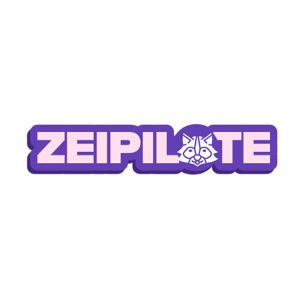

# ZeiPilote

ZeiPilote est une application web moderne construite avec Next.js pour gérer efficacement les clients, les projets et les factures. Elle offre une interface simplifiée pour les tâches de gestion d'entreprise.



## Fonctionnalités

- **Gestion des Clients**: Créez et gérez les profils clients
- **Suivi des Projets**: Gardez une trace des projets en cours et terminés
- **Génération de Factures**: Créez des factures professionnelles pour vos clients
- **Interface de Tableau de Bord**: Surveillez vos activités commerciales en un coup d'œil
- **Export/Import de Données**: Sauvegardez et restaurez facilement vos données

## Technologies Utilisées

- Next.js 14
- TypeScript
- Tailwind CSS
- React Hook Form
- Headless UI

## Installation

1. Clonez le dépôt :
```bash
git clone https://github.com/zeitounmax/zeipilote.git
cd zeipilote
```

2. Installez les dépendances :
```bash
npm install
```

3. Démarrez le serveur de développement :
```bash
# Sur Linux/macOS
./run.sh

# Sur Windows
run.bat
```

L'application sera accessible sur [http://localhost:3000](http://localhost:3000)

## Contribution

Les contributions sont les bienvenues ! Pour contribuer :

1. Forkez le projet
2. Créez votre branche de fonctionnalité (`git checkout -b feature/AmazingFeature`)
3. Committez vos changements (`git commit -m 'Add: une nouvelle fonctionnalité'`)
4. Poussez vers la branche (`git push origin feature/AmazingFeature`)
5. Ouvrez une Pull Request

### Guidelines de Contribution

- Respectez le style de code existant
- Ajoutez des tests pour les nouvelles fonctionnalités
- Mettez à jour la documentation si nécessaire
- Assurez-vous que tous les tests passent

## Auteur

**Zeima** - *Créateur initial* - [@zeitounmax](https://github.com/zeitounmax)

## Licence

Ce projet est sous licence Creative Commons Attribution 4.0 International (CC BY 4.0). Cela signifie que vous pouvez :

- Copier et redistribuer le matériel sous n'importe quel format
- Adapter, transformer et développer le matériel

Sous les conditions suivantes :
- Vous devez donner le crédit approprié à l'auteur original (Zeima)
- Vous devez inclure un lien vers la licence
- Vous devez indiquer si des modifications ont été apportées

Pour plus d'informations sur la licence, visitez : [Creative Commons BY 4.0](https://creativecommons.org/licenses/by/4.0/deed.fr)

---
Créé et maintenu par [@zeitounmax](https://github.com/zeitounmax)
